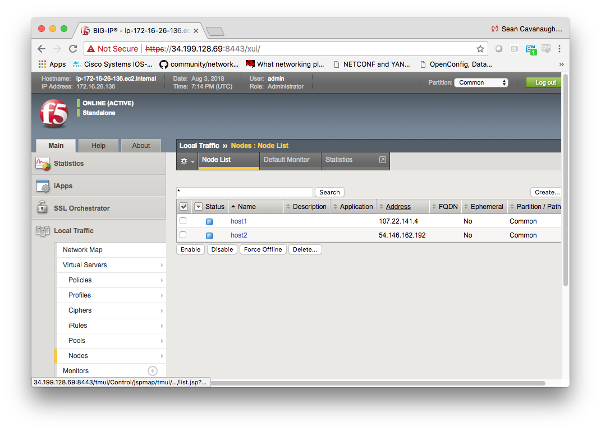

# Exercise 1: Adding nodes to F5 BIG-IP

## Table of Contents

- [Objective](#objective)
- [Guide](#guide)
- [Playbook Output](#playbook-output)
- [Solution](#solution)

# Objective

Demonstrate use of the [BIG-IP node module](https://docs.ansible.com/ansible/latest/modules/bigip_node_module.html) to add two RHEL (Red Hat Enterprise Linux) web servers as nodes for the BIG-IP load balancer.

# Guide

## Step 1:

Using your text editor of choice create a new file called `bigip-node.yml`.

```
[student1@ansible ~]$ nano bigip-node.yml
```

>`vim` and `nano` are available on the control node, as well as Visual Studio and Atom via RDP

## Step 2:

Enter the following play definition into `bigip-node.yml`:

``` yaml
---
- name: BIG-IP SETUP
  hosts: lb
  connection: local
  gather_facts: false
```

- The `---` at the top of the file indicates that this is a YAML file.
- The `hosts: lb`,  indicates the play is run only on the lb group.  Technically there only one F5 device but if there were multiple they would be configured simultaneously.
- `connection: local` tells the Playbook to run locally (rather than SSHing to itself)
- `gather_facts: false` disables facts gathering.  We are not using any fact variables for this playbook.

## Step 3

Next, add the first `task`. This task will use the `bigip_node` module configure the two RHEL web servers as nodes on the BIG-IP F5 load balancer.

``` yaml
---
- name: BIG-IP SETUP
  hosts: lb
  connection: local
  gather_facts: false

  tasks:

  - name: CREATE NODES
    bigip_node:
      server: "{{private_ip}}"
      user: "{{ansible_user}}"
      password: "{{ansible_ssh_pass}}"
      server_port: "8443"
      host: "{{hostvars[item].ansible_host}}"
      name: "{{hostvars[item].inventory_hostname}}"
      validate_certs: "no"
    loop: "{{ groups['webservers'] }}"
```

>A [loop](https://docs.ansible.com/ansible/latest/user_guide/playbooks_loops.html) will repeat a task on a list provided to the task.  In this case it will loop twice, once for each of the two web servers.

- `name: CREATE NODES` is a user defined description that will display in the terminal output.
- `bigip_node:` tells the task which module to use.  Everything except `loop` is a module parameter defined on the module documentation page.
- The `server: "{{private_ip}}"` parameter tells the module to connect to the F5 BIG-IP IP address, which is stored as a variable `private_ip` in inventory
- The `user: "{{ansible_user}}"` parameter tells the module the username to login to the F5 BIG-IP device with
- The`password: "{{ansible_ssh_pass}}"` parameter tells the module the password to login to the F5 BIG-IP device with
- The `server_port: 8443` parameter tells the module the port to connect to the F5 BIG-IP device with
- The `host: "{{hostvars[item].ansible_host}}"` parameter tells the module to add a web server IP address already defined in our inventory.
- The `name: "{{hostvars[item].inventory_hostname}}"` parameter tells the module to use the `inventory_hostname` as the name (which will be host1 and host2).
- The `validate_certs: "no"` parameter tells the module to not validate SSL certificates.  This is just used for demonstration purposes since this is a lab.
- `loop:` tells the task to loop over the provided list.  The list in this case is the group webservers which includes two RHEL hosts.

## Step 4

Run the playbook - exit back into the command line of the control host and execute the following:

```
[student1@ansible ~]$ ansible-playbook bigip-facts.yml
```

# Playbook Output

The output will look as follows.

```yaml
[student1@ansible]$ ansible-playbook bigip-node.yml

PLAY [BIG-IP SETUP] ************************************************************

TASK [CREATE NODES] ************************************************************
changed: [f5] => (item=host1)
changed: [f5] => (item=host2)

PLAY RECAP *********************************************************************
f5                         : ok=1    changed=1    unreachable=0    failed=0
```

# Solution
The finished Ansible Playbook is provided here for an Answer key.  Click here: [bigip-node.yml](bigip-node.yml) or see below:

```yaml
---
- name: BIG-IP SETUP
  hosts: lb
  connection: local
  gather_facts: false

  tasks:

  - name: CREATE NODES
    bigip_node:
      server: "{{private_ip}}"
      user: "{{ansible_user}}"
      password: "{{ansible_ssh_pass}}"
      server_port: "8443"
      host: "{{hostvars[item].ansible_host}}"
      name: "{{hostvars[item].inventory_hostname}}"
      validate_certs: "no"
    loop: "{{ groups['webservers'] }}"
```

# Verifying the Solution

Login to the F5 with your web browser to see what was configured.  Grab the IP information for the F5 load balancer from the lab_inventory/hosts file, and type it in like so: https://X.X.X.X:8443/

The list of nodes can be found by navigating the menu on the left.  Click on Local Traffic-> then click on Nodes.


You have finished this exercise.  [Click here to return to the lab guide](../README.md)
