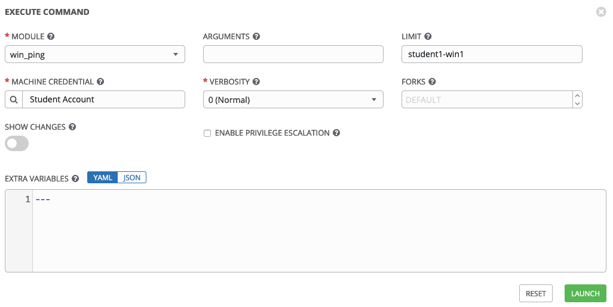
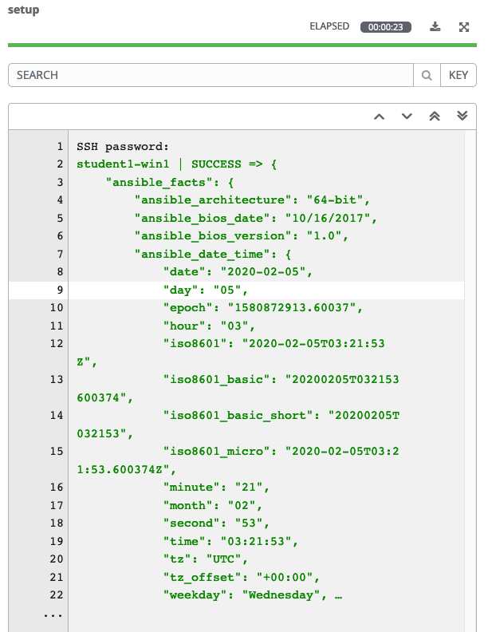

演習 2: アドホックコマンド  
==========================

最初の演習では、いくつかのアドホックコマンドを実行して、Ansibleがどのように機能するかを理解します。 Ansible アドホックコマンドを使用すると、プレイブックを作成しなくてもリモートノードでタスクを実行できます。多くのリモートノードに対して1つまたは2つのことを簡単に行う必要がある場合に非常に便利です。  

ステップ 1:
-------

左パネルの **インベントリー**をクリックし、インベントリ **Windows Workshop Inventory** をクリックします。  
インベントリーの詳細が表示されたら**ホスト**をクリックします。  

各ホストの横にはチェックボックスがあります。アドホックコマンドを実行する Windows グループに属するホストの横にあるチェックボックスをオンにします。**コマンドの実行** ボタンが有効になったことを確認し、クリックします。  

**コマンドの実行** ウィンドウが表示されます。ここからアドホックコマンドを実行する事が出来ます。  

まずは簡単なことから始めましょう♪  
ホストへの ping です。 `win_ping` モジュールは、Windows ホストが応答することを確認します。これは一般的に知られているネットワークの*ping*ではなく、Ansible のターゲットホストへ接続と認証の両方を検証します。

下記を入力ください。  

| キー                | 値           | 備考                                                            |
|--------------------|-----------------|-----------------------------------------------------------------|
| モジュール             | `win_ping`      |                                                                 |
| 引数         |                 | 空欄のままでOKです                                             |
| 制限              |                 | 選択したホストが自動で入力されます |
| マシンの認証情報 | Student Account |                                                                 |

**起動** をクリックするとジョブ表示に切り替わります。Ansible Towerのすべてのジョブとアクションは記録され保存されます。これらのログは自動でローテーションする形式をとっていますが、Splunk や ELK などの別のログシステムに自動的にエクスポートすることもできます。  

以下の通り、ログには誰がジョブ、どのホストに対して、いつジョブを実行したかなどの情報が含まれます。  

また、実際の出力結果が表示されます。接続が成功した場合、次のような結果が表示されます。

結果表示は、使用するモジュールによって異なります。タスクに応じて異なるデータセットを処理するためです。ただ、使用されているモジュールに関係なく、常に成功、失敗、変更、スキップのいずれかの色分けされたステータスが表示されます。これは共通です。  

ステップ 2:
-------

次に、`win_shell` モジュールを使用して PowerShell コマンドを実行し、出力を表示する方法を見てみましょう。

| キー                | 値           | 備考 |
|--------------------|-----------------|------|
| モジュール             | `win_shell`     |      |
| 引数          | `Get-Service`   |      |
| マシンの認証情報 | Student Account |      |

ジョブを起動し、結果を確認してみましょう。Powershell コマンドが返した内容が直接表示されていることが分かります。この表示内容を変数に保存し、後でAnsibleプレイブック内で利用することも可能です。  

今度は引数に `Get-Process` を入力し、Powershell コマンドを実行してみましょう.

| キー                | 値           | 備考 |
|--------------------|-----------------|------|
| モジュール             | `win_shell`     |      |
| 引数          | `Get-Process`   |      |
| マシン認証情報 | Student Account |      |

ステップ 3:
-------

次に、Ansible の強力な機能の1つである、対象ノードのファクト情報について演習してみましょう。今回の演習では、Windows ノードの構成を確認します。利用するのは、`setup` モジュールです。このモジュールはリモートホストからさまざまなデータを取得し、そのデータを Ansible ファクトとして返します。ファクトには、OSバージョン、ハードウェア構成、その他のデータポイントなどターゲットノードに関する様々な情報が含まれてており、この情報を基にタスク実行の要否を判断したり、OSバージョンに基づいたパッケージ名の決定したりなど、プレイブック内で様々な形で再利用することが可能です。  

デフォルトで、 `setup` モジュールはすべてのプレイブックの先頭で自動的に実行されます。このため、このファクト情報は常にプレイブックで利用可能です。

早速 `setup` モジュールを実行して出力を見てみましょう。下記情報を使用して**コマンド実行**を行います。

| キー                | 値           | 備考                |
|--------------------|-----------------|---------------------|
| モジュール             | `setup`         |                     |
| 引数          |                 | 空欄のまま |
| マシンの認証情報 | Student Account |                     |

実行すると以下のような結果が確認できます。  

(**Note:** 上記の出力の23行目に表示されている3つのドットをクリックすると、`setup`モジュールによって返されたすべてのファクトが表示されます。.)

ステップ 4:
-------

では、`win_feature` モジュールを使用して IIS をインストールしましょう。引数は、もう少し複雑になります。

| キー                | 値                           | 備考|
|--------------------|---------------------------------|------|
| モジュール             | `win_feature`                   |      |
| 引数          | `name=Web-Server state=present` |      |
| マシンの認証情報 | Student Account                 |      |

ログテキストがオレンジ色になっていることがわかります。これは、システムに変更が加えられたことを示しており、緑は変更が加えられていないことを示しています。

ステップ 5:
-------

IIS　がインストールされたので、 `service` モジュールを使用して開始されていることを確認してみます。  

| キー                | 値                      | 備考 |
|--------------------|----------------------------|------|
| モジュール             | `win_service`              |      |
| 引数         | `name=W3Svc state=started` |      |
| マシンの認証情報 | Student Account            |      |

ステップ 6:
-------

最後に、インストールした IIS をクリーンアップしましょう。まず、IISサービスを止めます。  

| キー                | 値                      | 備考 |
|--------------------|----------------------------|------|
| モジュール             | `win_service`              |      |
| 引数          | `name=W3Svc state=stopped` |      |
| マシンの認証情報 | Student Account            |      |

ステップ 7:
-------

次に、IIS をアンインストールします。  

| キー                | 値                          | 備考 |
|--------------------|--------------------------------|------|
| モジュール             | `win_feature`                  |      |
| 引数          | `name=Web-Server state=absent` |      |
| マシンの認証情報 | Student Account                |      |

そして、ホストをリブートします。And now reboot the host.

| キー                | 値           | 備考                |
|--------------------|-----------------|---------------------|
| モジュール             | `win_reboot`    |                     |
| 引数          |                 | 空欄のまま |
| マシンの認証情報 | Student Account |                     |

> **ヒント**
>
> この `win_reboot` モジュールはマシンをリブートさせ、終了する前に完全に戻るのを待ちます。例えばプレイブックの途中でホストを再起動する必要がある場合、ホストにアクセスできないことによるプレイブックの残りの部分の失敗はありません。便利ですね。♬    

まとめ
----------

アドホックコマンドは、本当の意味でアドホックに実行する際に役に立ちます。逆に、環境内で自動化が大きくなると、アドホックコマンドの実行は面倒になってきます。上記の IIS の例では、本来は、面倒な一連のアドホックコマンド実行ではなく、プレイブック化して実行する方がよかったと思います。アドホックコマンド利用は、CLIからの個々のコマンドの実行に似ていますよね。これは Playbook を使った演習で、より明確になります。

*こんなコメント確認しましたか？* Windowsサーバーでタスクが実行されると、Ansibleはそのタスクを実行した後の再起動の要否も同時に取得可能です。以下は、IIS 機能を削除するコマンドの出力の一部です。このタスクの出力は、続行する前に再起動するかどうかが含まれており、ここを確認の後、rebbot_required = true なら、後続のタスクでリブートを実行するようなことも可能です。  

