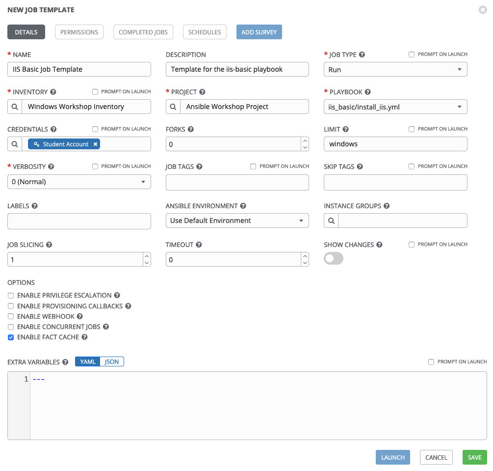
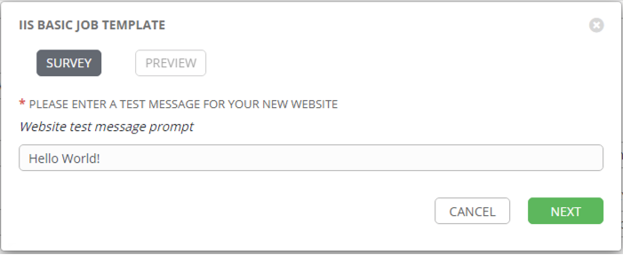
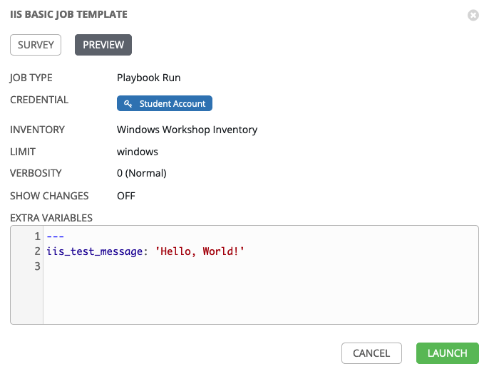

A job template is a definition and set of parameters for running an
Ansible job. Job templates are useful to execute the same job many
times.

Syncing your Project
====================

Before you can create a job template with a new playbook, you must first
sync your Project so that Tower knows about it. To do this, click
**Projects** and then click the sync icon next to your project. Once
this is complete, you can create the job template.

Creating a Job Template
=======================

Step 1:
-------

Select **Templates**

Step 2:
-------

Click the  icon, and select Job Template

Step 3:
-------

Complete the form using the following values

| Key         | Value                                        | Note |
|-------------|----------------------------------------------|------|
| Name        | IIS Basic Job Template                       |      |
| Description | Template for the iis-basic playbook          |      |
| JOB TYPE    | Run                                          |      |
| INVENTORY   | Windows Workshop Inventory                   |      |
| PROJECT     | Ansible Workshop Project                     |      |
| PLAYBOOK    | `iis-basic/install_iis.yml`                  |      |
| CREDENTIAL  | Type: **Machine**. Name: **Student Account** |      |
| LIMIT       | windows                                      |      |
| OPTIONS     | [*] ENABLE FACT CACHE                        |      |

Step 4:
-------

Click SAVE  and then select ADD SURVEY

Step 5:
-------

Complete the survey form with following values

<table>
<colgroup>
<col style="width: 50%" />
<col style="width: 50%" />
</colgroup>
<tbody>
<tr class="odd">
<td>
PROMPT
</td>
<td>
Please enter a test message for your new website
</td>
</tr>
<tr class="even">
<td>
DESCRIPTION
</td>
<td>
Website test message prompt
</td>
</tr>
<tr class="odd">
<td>
ANSWER VARIABLE NAME
</td>
<td>
iis_test_message
</td>
</tr>
<tr class="even">
<td>
ANSWER TYPE
</td>
<td>
Text
</td>
</tr>
<tr class="odd">
<td>
MINIMUM/MAXIMUM LENGTH
</td>
<td>
Use the defaults
</td>
</tr>
<tr class="even">
<td>
DEFAULT ANSWER
</td>
<td>
<em>Be creative, keep it clean, we’re all professionals here</em>
</td>
</tr>
</tbody>
</table>

Step 6:
-------

Select ADD 

Step 7:
-------

Select SAVE 

Step 8:
-------

Back on the main Job Template page, select SAVE
 again.

Running a Job Template
======================

Now that you’ve successfully created your Job Template, you are ready to
launch it. Once you do, you will be redirected to a job screen which is
refreshing in real time showing you the status of the job.

Step 1:
-------

Select TEMPLATES

> **Note**
>
> Alternatively, if you haven’t navigated away from the job templates
> creation page, you can scroll down to see all existing job templates

Step 2:
-------

Click the rocketship icon  for the
**IIS Basic Job Template**

Step 3:
-------

When prompted, enter your desired test message

Step 4:
-------

Select **NEXT** and preview the inputs.

Step 5:
-------

Select LAUNCH 

Step 6:
-------

Sit back, watch the magic happen

One of the first things you will notice is the summary section. This
gives you details about your job such as who launched it, what playbook
it’s running, what the status is, i.e. pending, running, or complete.

Next you will be able to see details on the play and each task in the
playbook.

Step 7:
-------

Once your job is successful, navigate to your new website (replace \#
with your student number)

    http://s#-win1.ansibleworkshop.com

If all went well, you should see something like this, but with your own
custom message of course.

Extra Credit
============

Now that you have IIS Installed, create a new playbook called
*remove\_iis.yml* to stop and remove IIS.

**Hint:** First stop the `W3Svc` service using the `win_service` module,
then delete the `Web-Server` service using the `win_feature` module.
Optionally, use the `win_file` module to delete the index page.

End Result
==========

At this point in the workshop, you’ve experienced the core functionality
of Ansible Tower. But wait… there’s more! You’ve just begun to explore
the possibilities of Ansible Tower. The next few lessons will help you
move beyond a basic playbook.
