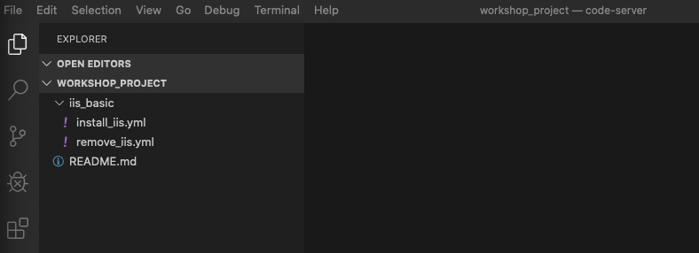
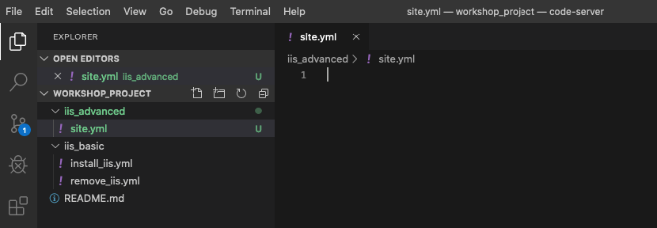
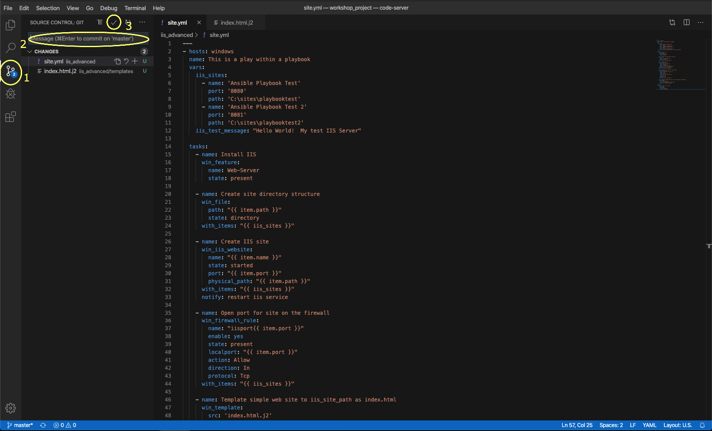
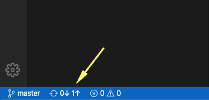
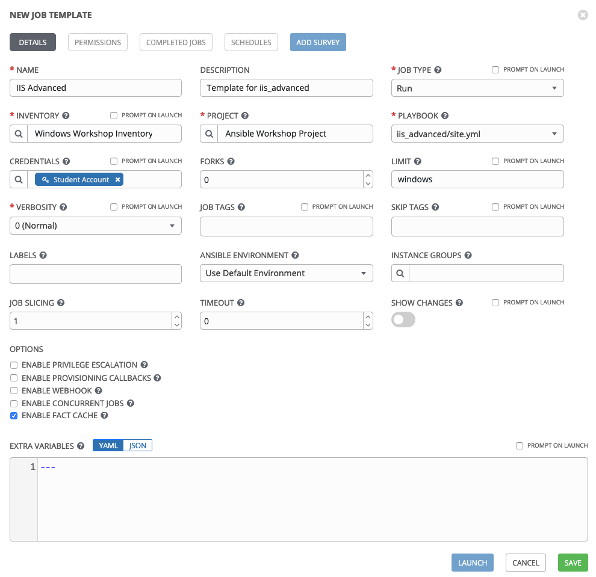
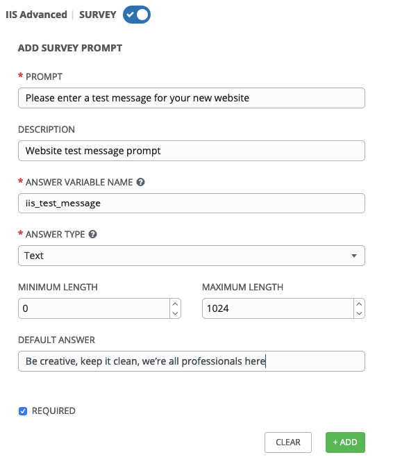
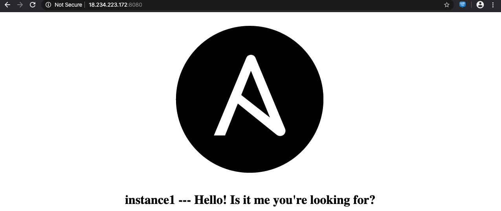

# 演習 5 - 高度な Playbook 

これまでの演習で、Ansible Playbook の書き方の基本を学びました。これを発展させてさらに柔軟性に富んだパワフルな Playbook の書き方について学んでいきましょう。♬  

Ansible を利用することにより、タスクをシンプルかつ簡単に繰り返すことが可能になります。ただ、ちょっと考えていただければ分かると思いますが、全てのシステムが同じ設定というわけではなく、Playbook 実行の際、システムごとの柔軟性が必要になることもよくあります。この様な場合に対応するため、 Ansible では、非常に柔軟性に富んだ利用しやすい変数の機能が備わっています。  

変数は、システム間の違いを吸収する手段を提供します。例えば、ポート、IPアドレス、またはディレクトリなどをシステムに毎に柔軟に変更することができます。  

ループを使用すると同じタスクを何度も繰り返すことができます。たとえば、複数のサービスを開始したり、複数の機能をインストールしたり、複数のディレクトリを作成したりする事が出来ます。Ansible ループを使用すると、1つのタスクでそれを実行できます。  

ハンドラーについても学びます。ハンドラーとは、特定のタスクが実行されたときにのみに追加で呼び出されるタスクです。例えば、httpd サービスの設定ファイルを変更した場合にのみ httpd サービスを再起動するというようなことが簡単に実現可能です。通常だと if 文で書いたり、複雑になりがちですよね。Ansible だと極めて簡単に記述する事が出来ます。  

変数、ループ、およびハンドラーを完全に理解するには、 これらのテーマに関する以下の Ansible ドキュメントをご覧ください。  
[Ansible 変数](http://docs.ansible.com/ansible/latest/playbooks_variables.html)　[Ansible ループ](http://docs.ansible.com/ansible/latest/playbooks_loops.html)　[Ansible ハンドラー](http://docs.ansible.com/ansible/latest/playbooks_intro.html#handlers-running-operations-on-change)  
  
## Playbook の作成

まず最初に新しい Playbook を作成します。演習3で作成したものに近いので問題なく理解できると思います。  

### ステップ 1:

Visual Studio Code 内で、gitリポジトリに新しいディレクトリを作成し、`site.yml` ファイルを作成します。  
以前に「iis_basic」ディレクトリを作成した*WORKSHOP_PROJECT*が存在していると思います。  



### ステップ 2: フォルダーとファイルの作成

*WORKSHOP_PROJECT*セクションにカーソルを合わせ、*New Folder*ボタンをクリックします。  

「iis_advanced」と入力してEnterキーを押します。  

`iis_advanced`フォルダーを右クリックし、*New_File*を選択します。  

`site.yml` と入力します。  

Playbook 編集用のエディターが右ペインに開きます。  



### ステップ 3:

Playbook のプレイの中にいくつかの変数を定義します。これには後程タスクの中で利用する Web サーバーに対する固有の構成情報が含まれています。  

```yaml
---
- hosts: windows
  name: This is a play within a playbook
  vars:
    iis_sites:
      - name: 'Ansible Playbook Test'
        port: '8080'
        path: 'C:\sites\playbooktest'
      - name: 'Ansible Playbook Test 2'
        port: '8081'
        path: 'C:\sites\playbooktest2'
    iis_test_message: "Hello World!  My test IIS Server"
```

### ステップ 4:

**install IIS**という新しいタスクを追加します。Playbook を書いた後、`ファイル` &gt; `保存`をクリックして変更を保存します。  

<!--  -->
```yaml
  tasks:
    - name: Install IIS
      win_feature:
        name: Web-Server
        state: present
    - name: Create site directory structure
      win_file:
        path: "{{ item.path }}"
        state: directory
      with_items: "{{ iis_sites }}"

    - name: Create IIS site
      win_iis_website:
        name: "{{ item.name }}"
        state: started
        port: "{{ item.port }}"
        physical_path: "{{ item.path }}"
      with_items: "{{ iis_sites }}"
      notify: restart iis service
```
<!--  -->


> **ヒント**
>
> - `vars:` 変数名と値に関する定義を行うことを宣言しています    
>
> - `iis_sites` iis_sitesという名前のリスト型変数を定義しています。その下の、`name` `port` `path` は iis_sites の下位の階層の変数を定義しています。  
>
> - `win_file:` ファイル、ディレクトリ、およびシンボリックリンクを作成、変更、削除するために使用されるモジュールです。  
>
> - `{{ item }}` 変数 iis_sites に対して変数の値を変化させながらタスクがループされます。ここでは、プレイで定義した `name`, `port`, `path` にそれぞれ2回、異なる値が入りながらループが実行されます。
>
> - `with_items: "{{ iis_sites }}` Ansible によるループの書き方の1つです。変数 iis_sites が持つ値を入力しながらループを実行するという意味です。ループ内での変数は、`{{ item }}` で、この中に定義された値が入ります。  
>
> - `notify: restart iis service` これはハンドラーに関する内容ですので、後述します。  

## Firewall の開放とファイルの送付

その後、IISサービスを開始するタスクを定義します。

### ステップ 1:

**iis_advanced folder** がハイライトされていることを確認して、*WORKSHOP_PROJECT* にカーソルを当て、*New Folder* ボタンをクリックします。  

`templates` と入力します。次に、この *templates* ホルダーを右クリックして *New File* ボタンを選択します。  

`index.html.j2` と入力します。  

テンプレート作成用のエディターが右ペインに開きます。次の様に入力します。


<!--  -->
```html
<html>
<body>

  <p align=center>
  <h1 align=center>{{ ansible_hostname }} --- {{ iis_test_message }}

</body>
</html>
```
<!--  -->


### ステップ 2:

ファイアウォールのポートの開放と、テンプレートによるファイル作成を行う様に Playbook `site.yml`を編集します。スラッシュをエスケープしないために、 `win_template`に一重引用符を使用しましょう。  

<!--  -->
```yaml
    - name: Open port for site on the firewall
      win_firewall_rule:
        name: "iisport{{ item.port }}"
        enable: yes
        state: present
        localport: "{{ item.port }}"
        action: Allow
        direction: In
        protocol: Tcp
      with_items: "{{ iis_sites }}"

    - name: Template simple web site to iis_site_path as index.html
      win_template:
        src: 'index.html.j2'
        dest: '{{ item.path }}\index.html'
      with_items: "{{ iis_sites }}"

    - name: Show website addresses
      debug:
        msg: "{{ item }}"
      loop:
        - http://{{ ansible_host }}:8080
        - http://{{ ansible_host }}:8081
```
<!--  -->

> **ヒント**
>
> **上記の解説です**
>
> - `win_firewall_rule:` ファイアウォールルールを作成、変更、および更新するために使用されるモジュールです。AWSの場合、通信に影響を与える可能性のあるセキュリティグループルールもあります。今回の演習では、ポート開放を行っています。    
>
> - `win_template:` jinja2テンプレートを使ってファイルを作成し、対象ホストにファイルをコピーしています。    
>
> - テンプレートの中では、変数に値が入力されファイルコピーが行われます。  
>
> - `debug:` `iis_basic` 同様、この Playbook も最後に Web サイトの URL を表示するように構成されています。    


## ハンドラーの利用

Ansible には便利な機能として、ハンドラーという機能が備わっています。一つの "場合分け" と考えていただいて大丈夫です。例えば、構成ファイルの更新、新しいパッケージのインストールなど、多くの場合、サービス/プロセスの再起動が必要となります。この様な場合、特定のタスクに Notify を記述しておき、後ろにハンドラーとして追加のタスクを記述しておきます。そうすると、Notifyのタスクが実行された時にのみハンドラーで記述されたタスクが実行されるという動作が簡単に実現できます。    

### ステップ 1:

ハンドラーの定義

```yaml
  handlers:
    - name: restart iis service
      win_service:
        name: W3Svc
        state: restarted
        start_mode: auto
```

> **ヒント**
>>
> - `handler:` notify を受けて実行されるということを除いては、ハンドラーはタスク様に記述されます。  
>
> - `notify: restart iis service` notity は、`win_iis_website` に追記されていますのでこのタスクが実行されたときに限り、`restart iis service` で記述されたハンドラーが呼び出されて実行されるという動きになります。  

## コミットと動作確認

改良された新しい Playbook の完成です♪  
早速、変更を保存し、GitLabにコミットしましょう。  

`File` をクリックし、`Save All` を選択。編集したファイルを保存します。


Source Control アイコンをクリックし (1)、変更内容を記述し (2)、上部のチェックをクリックします (3)。  



左下の青いバーの矢印をクリックして、gitlabに同期します。 プロンプトが表示されたら、`OK`をクリックしてコミットをプッシュおよびプルします。



コミットが完了するまでに5〜30秒かかります。 青いバーは回転を停止し、問題が0であることを確認します...　　

Playbook は以下のようになっているはずです。もう一度確認してみましょう。  
もし間違っていれば修正してみてください。特に、スペースには要注意です。  

<!--  -->
```yaml
---
- hosts: windows
  name: This is a play within a playbook
  vars:
    iis_sites:
      - name: 'Ansible Playbook Test'
        port: '8080'
        path: 'C:\sites\playbooktest'
      - name: 'Ansible Playbook Test 2'
        port: '8081'
        path: 'C:\sites\playbooktest2'
    iis_test_message: "Hello World!  My test IIS Server"

  tasks:
    - name: Install IIS
      win_feature:
        name: Web-Server
        state: present

    - name: Create site directory structure
      win_file:
        path: "{{ item.path }}"
        state: directory
      with_items: "{{ iis_sites }}"
      
    - name: Create IIS site
      win_iis_website:
        name: "{{ item.name }}"
        state: started
        port: "{{ item.port }}"
        physical_path: "{{ item.path }}"
      with_items: "{{ iis_sites }}"
      notify: restart iis service

    - name: Open port for site on the firewall
      win_firewall_rule:
        name: "iisport{{ item.port }}"
        enable: yes
        state: present
        localport: "{{ item.port }}"
        action: Allow
        direction: In
        protocol: Tcp
      with_items: "{{ iis_sites }}"

    - name: Template simple web site to iis_site_path as index.html
      win_template:
        src: 'index.html.j2'
        dest: '{{ item.path }}\index.html'
      with_items: "{{ iis_sites }}"
      
    - name: Show website addresses
      debug:
        msg: "{{ item }}"
      loop:
        - http://{{ ansible_host }}:8080
        - http://{{ ansible_host }}:8081

  handlers:
    - name: restart iis service
      win_service:
        name: W3Svc
        state: restarted
        start_mode: auto
```
<!--  -->

## ジョブテンプレートの作成

### ステップ 1:

ジョブテンプレートを作成する前に、最初にプロジェクトを再同期する必要があります。そこからやりましょう！  

> **Note**
>
> Webhook など特別な機能を使えば別ですが、基本的には、GitLab と Ansible Tower は自動では同期されません。つまり、今回のPlaybook の存在を Ansible Tower はまだ知りません。これを教えてあげる手段が、プロジェクトの同期です。やり方は・・・、そう、Ansible Tower の GUI の左ペインでプロジェクトをクリックして、丸くなった矢印をクリックですね！！  

### ステップ 2:

この Playbook をテストするには、この Playbook を実行する新しいジョブテンプレートを作成する必要があります。*テンプレート*に移動して*追加*をクリックし、`ジョブテンプレート`を選択して2番目のジョブテンプレートを作成します。入力値は以下の通りです。  

| キー         | 値                      | 備考 |
|-------------|----------------------------|------|
| 名前        | IIS Advanced               |      |
| 説明 | Template for iis_advanced  |      |
| ジョブタイプ    | 実行                        |      |
| インベントリー   | Windows Workshop Inventory |      |
| プロジェクト     | Ansible Workshop Project   |      |
| PLAYBOOK    | `iis_advanced/site.yml`    |      |
| 認証情報  | Student Account            |      |
| 制限       | windows                    |      |
| オプション     | [*] ファクトキャッシュの有効化にチェック         |      |

  

### ステップ 3:

*保存* をクリックした上で、ADD SURVEY をクリック   

### ステップ 4:

Survey に以下を入力します。  

| キー                    | 値                                                    | 備考 |
|------------------------|----------------------------------------------------------|------|
| プロンプト                 |  	新しい Web サイト用のテストメッセージを入力します         |      |
| 説明            | Webサイトのテストメッセージ入力画面                             |      |
| 回答の変数名   | `iis_test_message`                                       |      |
| 回答のタイプ            | テキスト                                                     |      |
| 最大長 | デフォルトのまま                                         |      |
| デフォルトの応答         | Be creative, keep it clean, we’re all professionals here |      |

  

### ステップ 5:

*+ADD* をクリックします。

### ステップ 6:
-------

*保存* をクリックします。

### ステップ 7:

ジョブテンプレートの画面に戻るので、保存をクリックします。

## 作成した playbook を起動

作成した Playbook を実行して、動くかどうか確認してみましょう。  

### ステップ 1:

テンプレートを選択します。  

> **ヒント**
>
> ジョブテンプレートの作成ページから移動していない場合は、下にスクロールして既存のすべてのジョブテンプレートを表示することも可能です  

### ステップ 2:

**IIS Advanced**の右端にあるロケットアイコン  をクリックします。  

### ステップ 3:

Surveyで作成した入力画面が表示されるので、お好きなメッセージ(英語)を入力してください。♪

起動するとジョブ画面が表示され、出力をリアルタイムで見ることができます。  

ジョブが正常に完了すると、ジョブ出力の下部にWebサイトへの2つのURLが出力されます。  





[ワークショップ一覧に戻る](../readme.ja.md)

