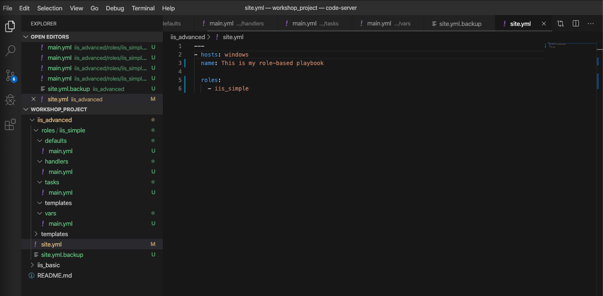
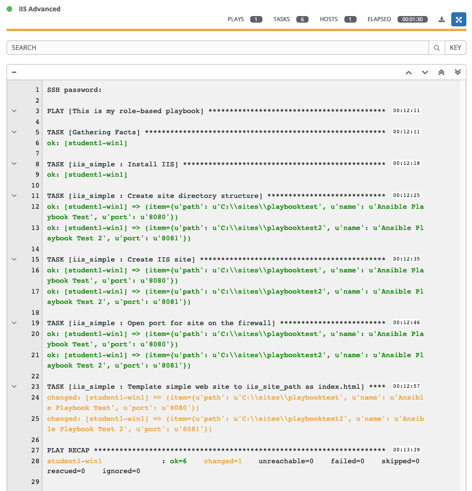

Although it is possible to write a playbook in one file as we’ve done
throughout this workshop, eventually you’ll want to reuse files and
start to organize things.

Ansible Roles are the way we do this. When you create a role, you
deconstruct your playbook into parts and those parts sit in a directory
structure. This is considered best practice and will save you a lot of
time in the future.

For this exercise, you are going to take the playbook you just wrote and
refactor it into a role.

Let’s begin with seeing how your iis-basic-playbook will break down into
a role…

Section 1: Create directory structure for your new role
=======================================================

Step 1:
-------

In Visual Studio Code, navigate to explorer and your *WORKSHOP_PROJECT* section where you previously made `iis_advanced`.

Select the **iis_advanced** folder.

Create a directory called **roles** by right-clicking on **iis_advanced**
and selecting *New Folder*

Now right-click **roles** and create a new folder underneath called
`iis_simple`.

Step 2:
-------

Within *iis\_simple* create new folders as follows:

-   defaults

-   vars

-   handlers

-   tasks

-   templates

Step 3:
-------

Within each of these new folders (except templates), right-click and
create *New File* Create a file called `main.yml` in each of these
folders. You will not do this under templates as we will create
individual template files. This is your basic role structure and
main.yml will be the default file that the role will use for each
section.

The finished structure will look like this:

Section 2: Breaking Your `site.yml` Playbook into the Newly Created `iis_simple` Role
=====================================================================================

In this section, we will separate out the major parts of your playbook
including `vars:`, `tasks:`, `template:`, and `handlers:`.

Step 1:
-------

Make a backup copy of `site.yml`, then create a new `site.yml`.

Navigate to your `iis_advanced` folder, right click `site.yml`, click
`rename`, and call it `site.yml.backup`

Create a blank new file called `site.yml` in the same folder

Step 2:
-------

Update site.yml to look like to only call your role. It should look like
below:

    ---
    - hosts: Windows
      name: This is my role-based playbook

      roles:
        - iis_simple

Step 3:
-------

Add a default variable to your role. Edit the
`roles\iis_simple\defaults\main.yml` as follows:

    ---
    # defaults file for iis_simple
    iis_sites:
      - name: 'Ansible Playbook Test'
        port: '8080'
        path: 'C:\sites\playbooktest'
      - name: 'Ansible Playbook Test 2'
        port: '8081'
        path: 'C:\sites\playbooktest2'

Step 4:
-------

Add some role-specific variables to your role in
`roles\iis_simple\vars\main.yml`.

    ---
    # vars file for iis_simple
    iis_test_message: "Hello World!  My test IIS Server"

> **Note**
>
> **Hey, wait… did we just put variables in two seperate places?**  
>
> Yes… yes we did. Variables can live in quite a few places. Just to
> name a few:  
>
> -   vars directory
>
> -   defaults directory
>
> -   group\_vars directory
>
> -   In the playbook under the `vars:` section
>
> -   In any file which can be specified on the command line using the
>     `--extra_vars` option
>
> -   On a boat, in a moat, with a goat *(disclaimer: this is a complete
>     lie)*
>
> Bottom line, you need to read up on [variable
> precedence](http://docs.ansible.com/ansible/latest/playbooks_variables.html#variable-precedence-where-should-i-put-a-variable)
> to understand both where to define variables and which locations take
> precedence. In this exercise, we are using role defaults to define a
> couple of variables and these are the most malleable. After that, we
> defined some variables in `/vars` which have a higher precedence than
> defaults and can’t be overridden as a default variable.

Step 5:
-------

Create your role handler in `roles\iis_simple\handlers\main.yml`.

    ---
    # handlers file for iis_simple
    - name: restart iis service
      win_service:
        name: W3Svc
        state: restarted
        start_mode: auto

Step 6:
-------

Add tasks to your role in `roles\iis_simple\tasks\main.yml`.

    ---
    # tasks file for iis_simple

    - name: Install IIS
      win_feature:
        name: Web-Server
        state: present

    - name: Create site directory structure
      win_file:
        path: "{{ item.path }}"
        state: directory
      with_items: "{{ iis_sites }}"

    - name: Create IIS site
      win_iis_website:
        name: "{{ item.name }}"
        state: started
        port: "{{ item.port }}"
        physical_path: "{{ item.path }}"
      with_items: "{{ iis_sites }}"
      notify: restart iis service

    - name: Open port for site on the firewall
      win_firewall_rule:
        name: "iisport{{ item.port }}"
        enable: yes
        state: present
        localport: "{{ item.port }}"
        action: Allow
        direction: In
        protocol: Tcp
      with_items: "{{ iis_sites }}"

    - name: Template simple web site to iis_site_path as index.html
      win_template:
        src: 'index.html.j2'
        dest: '{{ item.path }}\index.html'
      with_items: "{{ iis_sites }}"

Step 7:
-------

Add your index.html template.

Right-click `roles\iis_simple\templates` and create a new file called
`index.html.j2` with the following content:

    <html>
    <body>

      

      <h1 align=center>{{ ansible_hostname }} --- {{ iis_test_message }}

    </body>
    </html>

Now, remember we still have a *templates* folder at the base level of
this playbook, so we will delete that now. Right click it and Select
*Delete*.

Step 8: Commit
--------------

Click File → Save All to ensure all your files are saved.

Click the Source Code icon as shown below (1).

Type in a commit message like `Adding iis_simple role` (2) and click the
check box above (3).

Click the `synchronize changes` button on the blue bar at the bottom
left. This should again return with no problems.

Section 3: Running your new playbook
====================================

Now that you’ve successfully separated your original playbook into a
role, let’s run it and see how it works. We don’t need to create a new
template, as we are re-using the one from Exercise 5. When we run the
template again, it will automatically refresh from git and launch our
new role.

Step 1:
-------

Before we can modify our Job Template, you must first go resync your
Project again. So do that now.

Step 2:
-------

Select TEMPLATES

> **Note**
>
> Alternatively, if you haven’t navigated away from the job templates
> creation page, you can scroll down to see all existing job templates

Step 3:
-------

Click the rocketship icon  for the
**IIS Advanced** Job Template.

Step 4:
-------

When prompted, enter your desired test message

If successful, your standard output should look similar to the figure
below. Note that most of the tasks return OK because we’ve previously
configured the servers and services are already running.

Once your job is successful, navigate again to your websites to verify
they are still working (replace \# with your student number)

    http://s#-win1.ansibleworkshop.com:8080

and

    http://s#-win1.ansibleworkshop.com:8081

Section 5: Review
=================

You should now have a completed playbook, `site.yml` with a single role
called `iis_simple`. The advantage of structuring your playbook into
roles is that you can now add reusability to your playbooks as well as
simplifying changes to variables, tasks, templates, etc.

[Ansible Galaxy](https://galaxy.ansible.com) is a good repository of
roles for use or reference.
