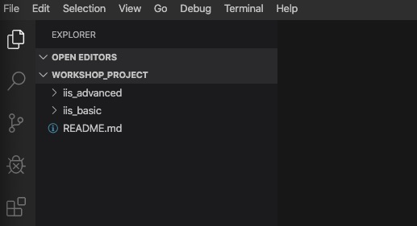
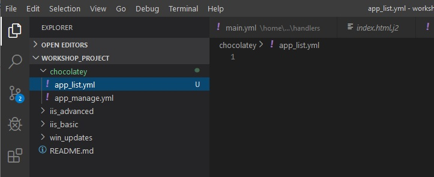
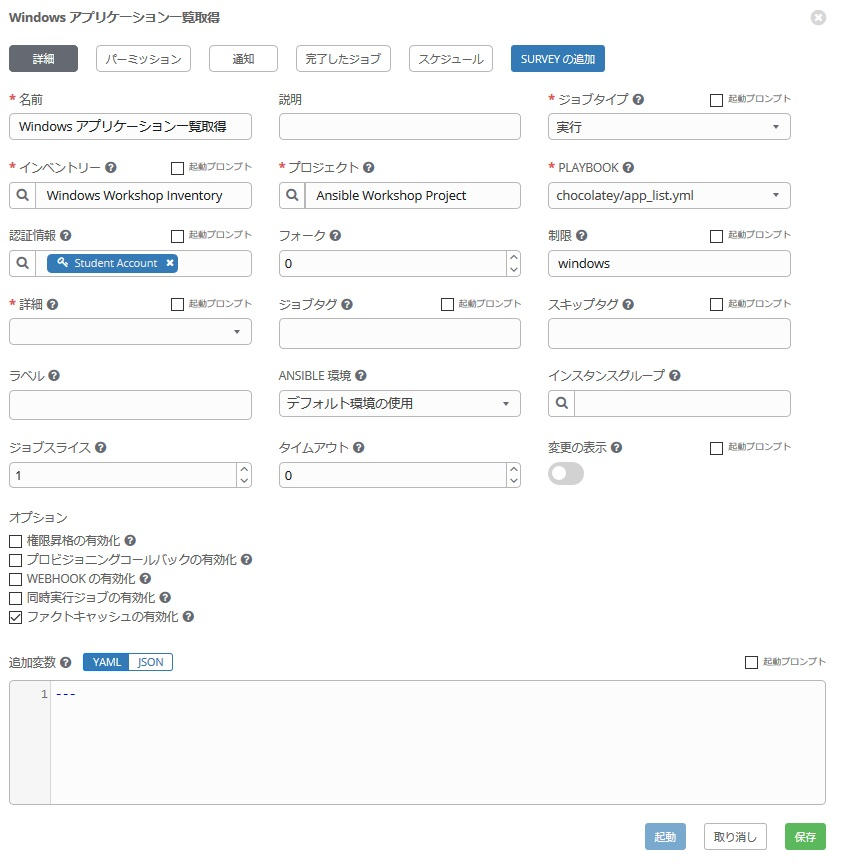
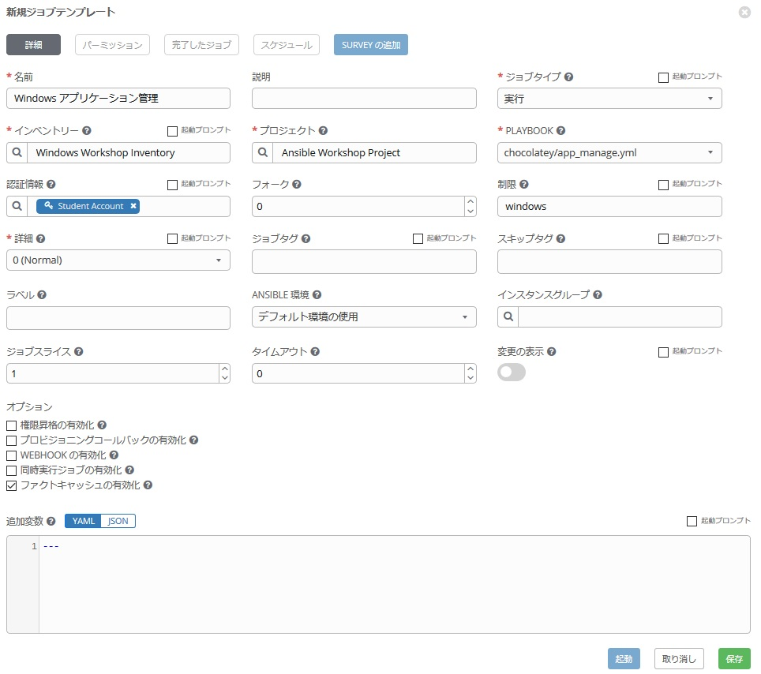
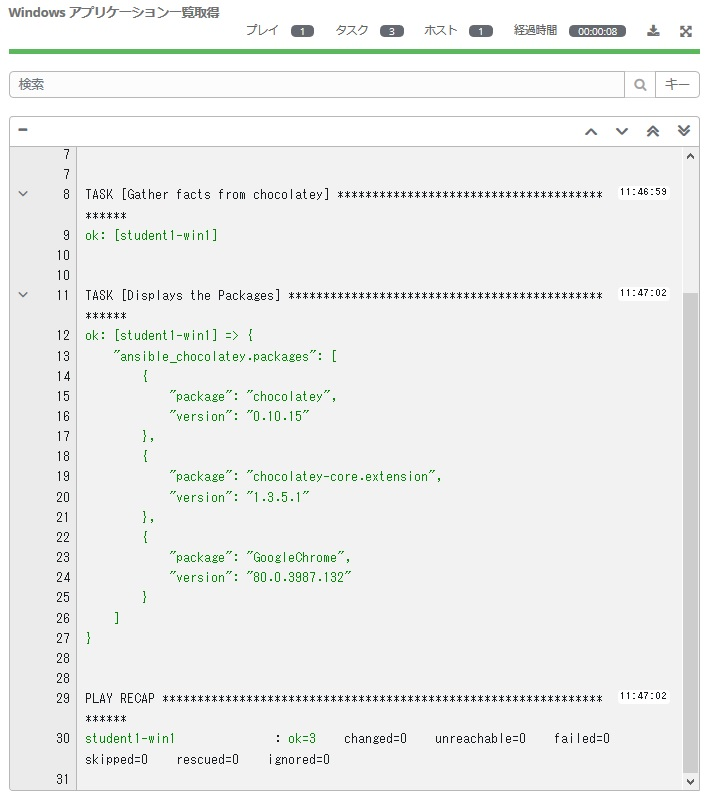

# 演習8 - Windwos のアプリケーション管理  

Windows を Ansible で管理するもう一つの大きなモチベーションはアプリケーションの管理の自動化です。  

Windows 上のアプリケーションを Ansible で管理する方法はいくつかあります。例えば、OS が提供するアプリケーションの管理であれば、演習2で行った win_feature モジュールが利用可能です。逆に OS 提供の機能ではなく、3rd パーティ製のアプリケーションの場合、[win_pacage](https://docs.ansible.com/ansible/latest/modules/win_package_module.html#win-package-module) というモジュールがあります。ただ、モジュールの Example を見ていただくと分かる通り、元来 Windows のアプリケーションはそれぞれのベンダーから CD や DVD などのメディアや msi、独自の URL で提供されるケースが多く、Linux の yum コマンドの様に、一括したリポジトリから同一手法でアプリケーションを管理する、ということがなかなか出来ませんでした。このため、パッケージの一括管理がなかなか難しかった面が否めませんでした。  

しかし、最近、[Chocolatey](https://chocolatey.org/) というリポジトリが登場し、Windows でもLinux同様の一括したアプリケーション管理が可能となってきました。[パッケージ](https://chocolatey.org/packages)も Chrome、Firefox、JRE、Putty、Adbe Reader、MS Officeなどなど非常に多彩です。 

凄く便利ですので、演習で確認してみましょう。♬  

### ステップ 1:

以前の演習で「iis_basic」ディレクトリなどを作成した WORKSHOP_PROJECT が存在していると思います。  



WORKSHOP_PROJECTセクションにカーソルを合わせ、*New Folder* ボタンをクリックします。`win_chocolatey` と入力します。  

次に、`win_chocolatey` ホルダーを右クリックして、*New File* を選択、`app_manage.yml` と入力します。  
もう一度、`win_chocolatey` ホルダーを右クリックして、*New File* を選択、`app_list.yml` と入力します。  



## Playbook の作成

今から二つの Playbook を作成します。

1. app_list.yml: Windows ホストに chocolatey 経由でインストールされているアプリケーションを表示します。  
2. app_manage.yml: Windows ホスト上にアプリケーションの、追加、削除、更新を行います。  

まず、1から実施してみましょう。  
`app_list.yml` の Playbook 編集用のエディターが右ペインに開いていることを確認し、以下作業を行います。  

<!--  -->
```yaml
---
- hosts: windows
  name: This is my Windows patching playbook

  tasks:
  - name: Gather facts from chocolatey
    win_chocolatey_facts:

  - name: Displays the Packages
    debug:
      var: ansible_chocolatey.packages
```
<!--  -->


> **ヒント**
>
> **上記の説明**
>
> -   `win_chocolatey_facts:` chocolatey で管理するアプリケーションに関する情報を取得するモジュールです。今回は、アプリケーションインストール前後で動作させてみて、インストールされたパッケージの差異を確認するために利用します。  


次に、`app_manage.yml` をクリックして、Playbook を以下のように編集してください。    

<!--  -->
```yaml
---
- hosts: windows
  name: This is my Windows patching playbook

  tasks:
  - name: Install Chrome
    win_chocolatey:
      name: googlechrome
      state: present
```
<!--  -->


> **ヒント**
>
> **上記の説明**
>
> -   `win_chocolatey:` chocolatey リポジトリと連携してアプリケーションを追加、削除、更新するモジュールです。今回はほんの一例として Googoe Chrome をインストールしてみました。他にも、`name` に `jre8` を指定すると、Javaのランタイム、そのほか、putty、vscodeなどと記述すれば、それぞれのアプリケーションを管理することが可能です。  

## 保存とコミット

chocolatey でアプリケーション一覧を表示させる Playbook 及び、アプリケーションの管理を行う Playbook の完成です♪  
早速、変更を保存し、GitLabにコミットしましょう。やり方は・・・、もうわかりますね？  

## ジョブテンプレートの作成

新しい Playbook を作成しましたので、Ansible Tower の GUI に戻ってプロジェクトの同期を行ってください。方法は・・・、もうお分かりですね？  

次に、このプレイブックを実行する新しいジョブテンプレートを作成する必要があります。*テンプレート*に移動して*追加*をクリックし、`ジョブテンプレート`を選択して新しいジョブテンプレートを作成します。

1. アプリケーション一覧表示用のジョブテンプレート作成  

次の値を使用してフォームに入力します。  

| キー                | 値                      | 備考 |
|--------------------|----------------------------|------|
| 名前               |Windows アプリケーション取得           |      |
| 説明        |                            |      |
| ジョブタイプ           | 実行                        |      |
| インベントリー          | Windows Workshop Inventory |      |
| プロジェクト            | Ansible Workshop Project   |      |
| PLAYBOOK           | `chocolatey/app_list.yml`     |      |
| 認証情報 | Student Account            |      |
| 制限              | windows                    |      |
| オプション            | [*] ファクトキャッシュの有効化にチェック      |      |



保存をクリックします。  

1. アプリケーション一管理用のジョブテンプレート作成  

同様にして、アプリケーション管理のジョブテンプレートを作成します。  

値は下記参照ください。    

| キー                | 値                      | 備考 |
|--------------------|----------------------------|------|
| 名前               |Windows アプリケーション管理|      |
| 説明        |                            |      |
| ジョブタイプ           | 実行                        |      |
| インベントリー          | Windows Workshop Inventory |      |
| プロジェクト            | Ansible Workshop Project   |      |
| PLAYBOOK           | `chocolatey/app_manage.yml`     |      |
| 認証情報 | Student Account            |      |
| 制限              | windows                    |      |
| オプション            | [*] ファクトキャッシュの有効化にチェック      |      |



### playbook の起動

作成した Playbook を以下の順番に実行してみて、表示内容を確認してみましょう♬  

1. `Windows アプリケーション一覧取得` ジョブテンプレートの起動
2. `Windows アプリケーション管理` ジョブテンプレートの起動
3. `Windows アプリケーション一覧取得` ジョブテンプレートの起動

どうなりましたでしょうか？Chromeは追加でインストールされましたか？  
インストールされると、以下のように表示されると思います。  



今回は演習を簡略化するため変数は使いませんでしたが、アプリケーション管理のところで、state オプションを変数化し、present/absent/latest を選択できるようにしておくと追加、削除、更新が実行時に選択出来て便利かもしれません。また、アプリケーションの一覧をcsv化して、そのファイルを読み込んできて複数のアプリケーションを一気にインストールなどということももちろん可能です。便利ですね。♬  

これでオプションのハンズオンも終了です！お疲れさまでした！！♬  
